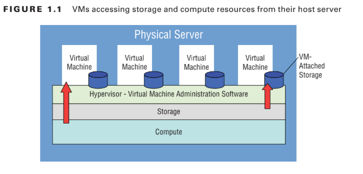

# Chapter 1: The Cloud

## Overview

Figuring out what the cloud is, the technologies that are build on it 
and the kind of savings and operational advantages that it can bring on as well as how cloud applications are different from the traditional one. This chapter is an introduction to the basics. 

## Key Concepts

### What is Cloud Computing ?

Public cloud is about using other people's servers to run your digital workloads.
There is no difference between running an application on cloud (Amazon's infrastructure in this case) and personal office as they involve concerns related to compute, memory, network and storage resources. However, cloud providers do provide better performance in terms of: 
- Cost
- Service
- Reliability

### How is this achieved? 

#### Highly available and scalable resources

- **Multiple Layers of redudancy**: When one component fails, its workload is automatically transferred to a healthy one 

- **Geographically connected resources**: Failure of one complete location could trigger a predefined relocation. 

- **Unlimited and on-demand computer power**: All available to the customers

- **Low pricing**: The pricing is far low compared to running workloads locally. 

#### Professionally secured infrastructure
IT security is always a moving target particularly for organizations.

AWS takes responsibility for the security of its platform's underlying networking and compute infrastructure. 

#### Metered Payment Model 
Any public cloud computing platform is capable of allocating resources automatically based on client's requests. For example, you can login on Amazon and create an instance (virtual server) which will be available within minutes. The flexible self-serve systems allows permits usage patterns which are not possible in the case of traditional systems e.g you can provision a resource for test and delete it immediately with little or no costs at all. There are also no capital expenses (Capex) expenses involved at all. 

### Server virtualization 
One of the main features of cloud computing is that allocating of resources does not require physical provisions of computing and storage based on clients demand. Instead resources of a single physical server are virtually subdivided and allocated. This ensures there is speed and effeciency. 

## Cloud Computing Models 
The following are available cloud computing models: 
[Different Computing Models](images/image.png)

- **Infrastructure as a Service (IaaS)**: Involves having direct access to the provider's compute, storage and networking assets. This provides an advantage of directly managing the physical resources and being responsible for the physical configuration of the operation stack. The main disadvantage of this model is the user is responsible for any bad configuration. Examples of IaaS AWS products include EC2 instance, EBS and Elastic load balancing. 

- **Platform as a Service (PaaS)**: This model hides the complexity of building an application by hidding the complexity of the infrastructure that runs it. Examples are Elastic Beanstalk and Elastic Container Service (ECS)

- **Software as Service (SaaS)**: This model provides services that meant to be used by the end users. Some of the common SaaS applications could include Gmail, Microsoft mail client, Simple Mail Service and Amazon Workspaces. !

## Scalability and Elasticity
Scalabity and elasticity are the key principles and it is important to understand them so as to leverage cloud benefits especially costs. 
- **Scalability**: Ability to automatically grow in capacity to seemlessly address any changes in demand. 
- **Elasticity**: AWS services e.g. Elastic Load balancing, Elastic compute cloud and elastic beanstalk e.t.c are build to easily and automatically resize. This provides the ability to define the minimum and maximum number of performance levels for the applications and AWS will add or remove resources automatically based on the needs. 

## Summary

Cloud providers like AWS enable customers to run their applications on the cloud without having to worry about the underlying physical infrastructure. They also benefit from ability to pay for what they only use, no capex, as well as take advantage of the elasticity and scability of the cloud. 
